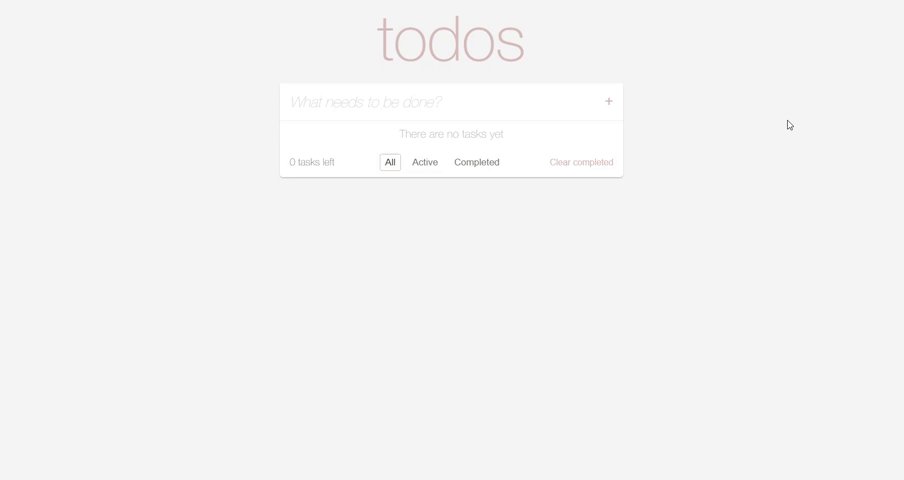

# To-Do List (React + TypeScript)



This is a simple To-Do List application built with **React** using **TypeScript** and **Vite** for bundling. It allows you to add, delete, mark tasks as completed, and filter them by status (All / Active / Completed).

> **Note:** This project is built with [Vite](https://vitejs.dev/). All development and build commands are defined in the `package.json` scripts.

## Features

- **Add Tasks**: Enter a task in the input field and press `Enter` or click the "+" button.
- **Mark Tasks**: Toggle the completion status of a task by clicking the checkbox.
- **Filter Tasks**: Use the buttons to display all tasks, only active tasks, or only completed tasks.
- **Delete Task**: Remove an individual task by clicking the `X` button.
- **Clear Completed**: Remove all completed tasks at once using the "Clear completed" button.
- **Items Left Counter**: Displays the number of tasks remaining to be completed at the bottom of the application.

## Project Structure

```
my-todo-app/
├─ src/
│  ├─ components/
│  │  ├─ InputContainer.tsx   # Component for task input
│  │  ├─ ToDoList.tsx         # Component for task list
│  │  └─ Footer.tsx           # Component for the footer (filters, counter, clear button)
│  ├─ hooks/
│  │  └─ useTodos.ts          # Custom hook managing task logic
│  ├─ types.ts                # Interfaces (Todo, Filter)
│  ├─ App.tsx                 # Main component assembling all parts
│  ├─ main.tsx                # React application entry point
│  └─ App.css                 # Application styles
├─ package.json
├─ tsconfig.json
├─ README.md
└─ ...
```

## Requirements

- Node.js (recommended version 14+)
- npm (version 6+)

## Installation and Running

1. **Clone** the repository or download the project archive.
2. **Navigate** to the project root directory:

   ```bash
   cd my-todo-app

   ```

3. **Install dependencies:**
   ```
   npm i
   ```
4. **Start the development server:**
   ```
   npm run dev
   ```

## Production Build

This project uses Vite, so you can build the production bundle as follows:

```
npm run build
```

The optimized production files will be generated in the dist folder.

## How to Use

1. Enter a task in the "What needs to be done?" input field and press "+" or `Enter`.
2. Mark tasks as completed by clicking the checkbox on the left.
3. Delete individual tasks by clicking the `X` button to the right of each task.
4. Use the filters at the bottom to switch between:
   - **All**: Show all tasks.
   - **Active**: Show only active tasks.
   - **Completed**: Show only completed tasks.
5. The "Clear completed" button removes all tasks marked as completed.
